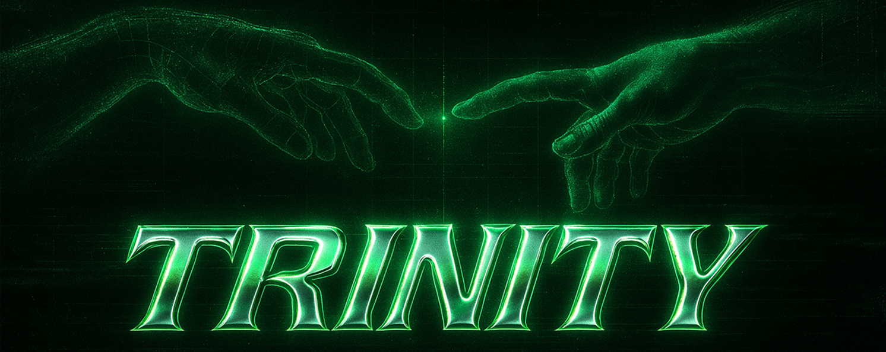

# Trinity



## Overview

Trinity is a one-round two-party computation (2PC) protocol that combines Laconic OT, garbled circuits, and PLONK to enable secure computation with zero-knowledge verified inputs. It allows mutually distrusting parties to compute securely without revealing their private inputs.

## Security Disclaimer

⚠️ **WARNING**: Trinity is a research project and is NOT ready for production use. The code has not undergone a formal security audit.

This implementation is meant for research, educational purposes, and proof-of-concept demonstrations only.

## Features

- Semi-honest garbling using the mpz garbling framework
- Supports Bristol fashion format circuits, which can be compiled using Boolify
- Unified API for both plain and Halo2 modes
- Single-round 2PC protocol with minimal interaction
- Zero-knowledge input verification using PLONK

## Architecture

Trinity leverages three core cryptographic components to provide secure and efficient two-party computations:

- **Garbled Circuits (via [mpz](https://github.com/privacy-scaling-explorations/mpz))**: Transforms boolean computation circuits into a secure, obfuscated format, enabling two parties to jointly compute results without revealing their private inputs. Garbled circuits rely heavily on Oblivious Transfer (OT) protocols for secure label exchange.

- **Laconic Oblivious Transfer (LOT)**: Employs Extractable Witness Encryption using KZG polynomial commitments to significantly reduce communication overhead, allowing efficient and secure transfer of encrypted inputs between parties.

- **PLONK Integration (via [PSE Halo2](https://github.com/privacy-scaling-explorations/halo2))**: Utilizes KZG polynomial commitment schemes to generate zero-knowledge proofs, ensuring input validity and correctness. PLONK acts as the cryptographic bridge connecting LOT schemes and ZK proofs, enabling participants to securely prove properties about their private inputs.

## Usage

Trinity operates in two modes:

### Plain Mode

This mode uses standard KZG commitments without a general purpose proof, suitable for scenarios where input verification is unnecessary.  
The implementation under `/plain_lot` is mirroring the paper implementation: [research-we-kzg](https://github.com/rot256/research-we-kzg).

### Halo2 Mode

This mode integrates PSE Halo2's PLONK implementation to ensure zero-knowledge verified inputs, guaranteeing protocol compliance.  
The default circuit is located in `halo2_lot/src/circuit.rs`. Currently, it performs basic input checks (e.g., verifying if inputs are bits), but more advanced logic, such as signature verification, can be added.

## Protocol Description

1. **Setup Phase**: Generate cryptographic parameters and the circuit representation.
2. **Evaluator Commit**: The evaluator commits to its inputs using either plain or Halo2 KZG. This commitment can be reused with any Boolean circuit adhering to the input data format.
3. **Garbler Phase**: The garbler garbles the circuit, incorporates its inputs, and encrypts the evaluator's gates based on the commitments.
4. **Evaluator Phase**: The evaluator obtains encrypted input labels via Laconic OT and evaluates the circuit to compute the output.

## Prerequisites

- Rust (1.70 or newer)
- Node.js (18 or newer)
- pnpm (8 or newer)
- wasm-pack

## Building and Testing

To test the Trinity Rust code

### Rust Library

```bash
# Build the Rust library
cd trinity
cargo build --release

# Run Rust tests
cargo test
```

### TypeScript Demo

```bash
# Build the TypeScript core (includes WASM compilation)
cd trinity-ts/packages/core
pnpm install
pnpm build:wasm  # Builds WASM bindings
pnpm build       # Compiles TypeScript

# Run the demo app
cd ../app
pnpm install
pnpm dev         # Starts development server at http://localhost:5173
```

## Acknowledgments

We would like to thank all contributors, researchers, and supporters who have helped make Trinity possible. Special thanks to @RiverRuby and the [Cursive team](https://github.com/cursive-team) for originally designing the scheme, the research team behind the Laconic OT paper and their implementation. Thanks Nakul and Breachy for their help in integrating secure garbling and Halo2 LOT. Additionally, we extend our gratitude to the authors of the mpz garbling framework and the PSE Halo2 team for their foundational work and inspiration.
