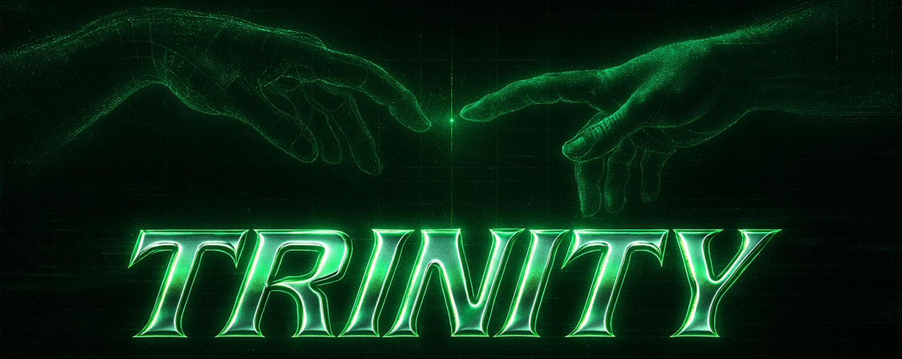
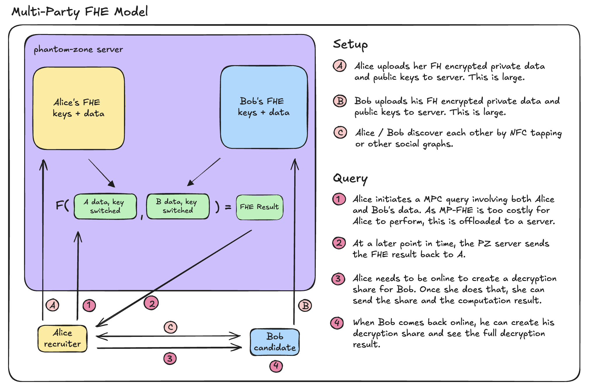
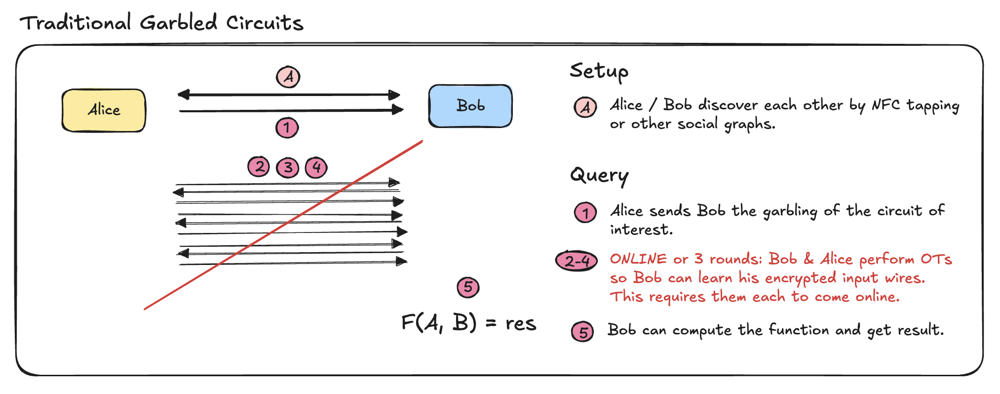
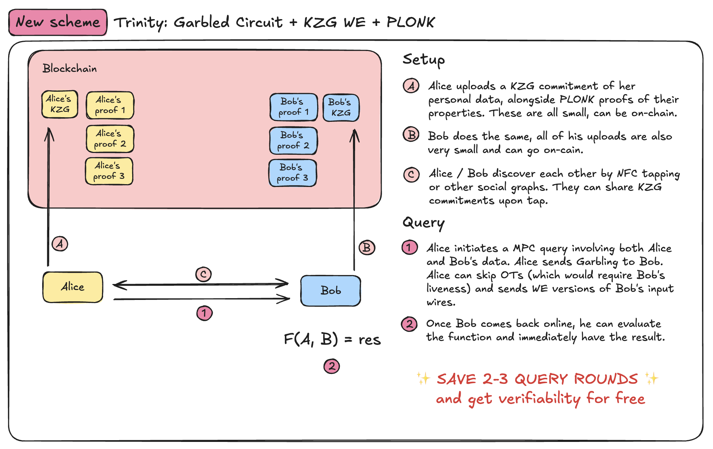

# Introduction to Trinity

## What is Trinity?

Trinity is a two-party computation (2PC) protocol designed to minimize interaction rounds, enable input verifiability, and facilitate reusability. It combines three key cryptographic concepts:

- Extractable Witness Encryption, powering Laconic Oblivious Transfer (LOT).
- Garbled Circuits.
- PLONK for verifiable inputs.

The core mechanism unifying these concepts is the KZG polynomial commitment scheme. Trinity offers a novel approach to handling user data by placing data objects at the center of computation. Users can commit to structured data (e.g., dictionaries), generate verifiable proofs about their contents, and privately interact with other parties.

The main goal of Trinity is to shift the perspective on zero-knowledge proofs (ZKPs) beyond simple gate computations, enabling them instead to serve as verified private inputs within secure 2PC interactions.

## How Is Trinity Different From Other Approaches?

Let’s assume Alice and Bob each hold a private input (`a`, `b`) and want to compute `f(a, b)` without revealing anything to each other. There are several cryptographic ways to achieve this, each with different trade-offs:

### 1. **Multiparty FHE (Fully Homomorphic Encryption)**

FHE enables computing arbitrary functions on encrypted inputs. With multiparty FHE, each party encrypts their inputs under a joint key, and computation happens homomorphically.

- **Pros**:
  - Minimal interaction.
  - Can delegate computation to untrusted servers.
- **Cons**:
  - High computational cost, even for simple functions.
  - Still impractical for most real-time use cases.
  - Complex key management across parties.

> _Good fit when clients are weak and untrusted computation is offloaded to powerful servers (e.g., dark pools, PSI)._

---

### 2. **Secret Sharing-based MPC**

Each party splits their input into shares and distributes them across multiple computation nodes. The function `f` is then evaluated collaboratively over the shares.

- **Pros**:
  - Efficient for many inputs and functions.
  - Mature tooling.
- **Cons**:
  - Requires high liveness and low latency between nodes.
  - Expensive in bandwidth and synchronization.
  - Hard to scale in high-latency environments.

> _Great when you control your infrastructure or have low-latency assumptions (e.g., private statistics, secure ML inference)._

---

### 3. **Garbled Circuits with Classical OT**

In classical 2PC using GC, one party (the _garbler_) encrypts the circuit, and the other (the _evaluator_) receives encrypted wire values via **Oblivious Transfer** (OT). It's a well-established approach with strong security guarantees under semi-honest or malicious models.

- **Pros**:
  - Mature cryptographic primitive.
  - Supports arbitrary functions.
  - Non-interactive once the circuit is garbled and inputs are transferred.
- **Cons**:
  - No built-in verifiability of inputs — relies on trusted setup or assumptions.
  - Cannot reuse or prove input commitments across sessions.

> _Good for basic 2PC with moderate setup cost when parties are trusted to follow protocol but don’t want to reveal inputs._

---

### 4. **Trinity: Laconic OT + GC + ZK Inputs**

Trinity enables two parties to compute a function using garbled circuits — with a twist:

- **Inputs are committed with KZG**.
- **Verifiability is added via ZK (PLONK)**.
- **Oblivious Transfer is optimized using Extractable Witness Encryption**.

- **Pros**:
  - Input integrity is provable.
  - Few interaction rounds (Laconic OT).
  - No need to trust delegated infrastructure.
  - Input commitment is reusable.
- **Cons**:
  - Limited to 2PC.
  - Verifiability with Halo2 PLONK is costly.

> _Ideal for verified 2PC in low-trust environments where inputs need to be reused or proven (e.g., self-attested data proofs, benchmarking, private voting)._

---

### 📊 Comparison Table

| Approach                    | Trust Model                      | Interaction Rounds | Computation Cost | Bandwidth | Input Verifiability | Best For                      |
| --------------------------- | -------------------------------- | ------------------ | ---------------- | --------- | ------------------- | ----------------------------- |
| **FHE**                     | Untrusted server                 | Low                | 🚨 High          | Low       | ❌                  | Offloaded compute             |
| **Secret Sharing MPC**      | Honest majority                  | High               | Moderate         | High      | ❌                  | Server-side compute           |
| **GC + Classical OT**       | No delegation, Semi-honest       | Moderate           | Moderate         | Moderate  | ❌                  | Generic 2PC                   |
| **Trinity (GC + LOT + ZK)** | No delegation, Semi-honest (+ZK) | 🔁 Few             | Low–Moderate     | Low       | ✅ (PLONK)          | Verified 2PC, reusable inputs |

## 🧩 Applications and Use Cases

Trinity is built for use cases that **don’t require liveness** — meaning participants can interact **asynchronously**, without being online at the same time. It’s ideal for **private matching**, **selective interactions**, and **verifiable decision logic** over user data.

At its core, Trinity allows a user to:

- Commit to a **bitstring** representing their private input (e.g., encoded attributes, preferences, or selections),
- Prove the **validity of this input** via a zero-knowledge proof (e.g., PLONK),
- Publish the commitment and proof (e.g., on-chain or off-chain),
- Allow others to interact by garbling a circuit with their own private inputs and returning it for evaluation.

### 🛒 **Use Case: Provable Listings & Private Bidding (The Weeknd Concert Ticket)**

Imagine a user wants to resell a concert ticket. Here's how Trinity could support a privacy-preserving, verifiable flow:

1. **Ownership Proof**  
   The seller generates a ZK proof of ticket ownership using, for example, a ZKEmail circuit verified via Halo2.

2. **Price Encoding and Commitment**  
   They encode their desired price range (e.g., 100–150 USD) as a bitstring input to a 2PC Boolean circuit, and commit to it in the same Halo2 circuit as above.

3. **Public Posting**  
   The ZK proof containing the KZG commitmentare is posted (e.g., on a smart contract or IPFS), making the listing publicly visible but still private in terms of content.

4. **Private Offer Submission**  
   A buyer retrieves the public circuit, garbles it with their own price offer (also as a bitstring), and sends the garbled circuit back.

5. **Secure Evaluation**  
   The seller evaluates the garbled circuit to check whether the offer matches their private range, learning only whether it is acceptable — not the exact bid.

> This enables **sealed-bid auctions**, **private marketplaces**, or **anonymous deal matching**, while retaining cryptographic integrity.

---

### 🎮 Additional Scenarios

- **ZK Social Discovery**:  
  Users encode and commit to private attributes (e.g., age > 18 through anon-aadhaar or self.xyz, shared interest tags), and interact via circuits that match compatible criteria without revealing exact values.

- **Private Gameplay**:  
  In games involving secret strategies (e.g., card games, bluff mechanics), players commit to private state and verify interactions using 2PC.

- **Credential Matching**:  
  In employment or dating contexts, participants encode structured claims (e.g., degrees, preferences, income ranges) and privately compute matches.

## Structure of this Documentation

- **[Laconic Oblivious Transfer](./laconic_ot.md)**: Learn about the efficient OT protocol used in Trinity.
- **[Garbled Circuits and Laconic OT](./gc_lot.md)**: Understand how garbled circuits are combined with LOT.
- **[ZK Input Verification with PLONK/KZG](./zk_input_commit.md)**: Explore how inputs are made verifiable using ZK proofs.

## Target Audience

This documentation is tailored for cryptographers, developers, and researchers seeking to leverage Trinity’s advanced cryptographic techniques for secure, verifiable, and private two-party computation.

## Acknowledgments

We would like to thank all contributors, researchers, and supporters who have helped make Trinity possible. Special thanks to [Vivek](https://github.com/RiverRuby) and the [Cursive team](https://github.com/cursive-team) for originally designing the scheme, the research team behind the [Laconic OT paper and their implementation](https://github.com/rot256/research-we-kzg). Thanks [Nakul](https://github.com/nakkstar123) and [brech1](https://github.com/brech1) for their help in integrating secure garbling and Halo2 LOT. Additionally, we extend our gratitude to the authors of the [mpz](https://github.com/privacy-scaling-explorations/mpz) library and the [PSE Halo2](https://github.com/privacy-scaling-explorations/halo2) team for their foundational work and inspiration.
