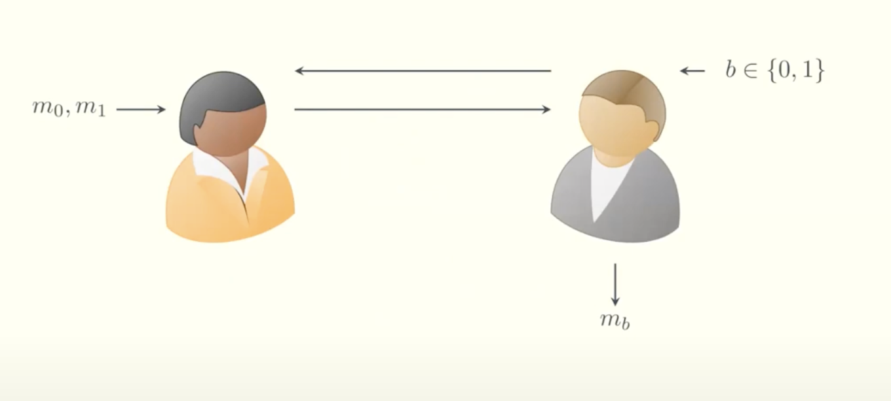
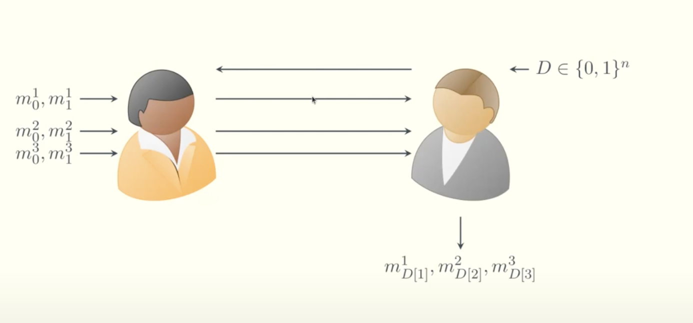

# Laconic Oblivious Transfer (OT)

## Overview

Laconic OT plays a crucial role in Trinity, it's the core fo the protocol that enables fewer round of communication between the two parties.

- **Definition**:  
  Laconic Oblivious Transfer (Laconic OT) is a two-message protocol where the **receiver holds a large input** (typically a dictionary $D$), and the **sender holds a small input**—an index $i$ and two messages $m_0$, $m_1$. The receiver learns $m_b$, where $b = D[i]$ is the $i$-th bit of their dictionary, without learning anything about $m_{1-b}$. Meanwhile, the sender learns nothing about the receiver's dictionary.

- **Motivation**:  
  Laconic OT is crucial for secure two-party computation in bandwidth-constrained or interaction-minimal settings. It minimizes communication by shifting the burden of computation to the receiver (reverse delegation), enabling succinct, two-message protocols in advanced cryptographic settings like:
  - **RAM programs with private memory access**
  - **Private set intersection**

This is a traditional OT between Alice and Bob. Informally, OT guarantees that Bob receives from Alice the message corresponding to his choice bit $b$ (i.e., $m_b$), without revealing $b$ to Alice or learning anything about $m_{1-b}$.

In the traditional protocol, each message transfer requires two rounds of communication between Alice and Bob.

The Laconic version of OT improves efficiency. Bob compresses all his $n$ bits into a dictionary $D$ and sends a succinct commitment of $D$ to Alice. This allows the transfer of $n$ messages between Alice and Bob in just two communication rounds—effectively batching all the Oblivious Transfers together.

Witness Encryption (WE) for KZG is used to compress the dictionary Bob sends. After receiving the commitment $\mathcal{com}$ from Bob, Alice encrypts her messages under the KZG openings. For example, she encrypts $m_0^1$ under the opening for $0$ at position $1$, and $m_1^1$ under the opening for $1$ at position $1$. Bob can only decrypt the message corresponding to the bit he committed to at position $1$ of $D$, by providing a valid opening proof.

## Key Concepts

### The Laconic Property

"Laconic" in this context refers to **communication complexity being sublinear** in the receiver's input size. Instead of transmitting the entire database or program, the receiver sends a **digest** (a succinct commitment), and the sender replies with a short ciphertext. This is especially beneficial when:

- The receiver has large input ($D \in \{0,1\}^n$)
- The sender’s input and communication must remain small
- Round complexity is critical (only 2 messages total)

**Benefits**:

- Enables practical, low-latency secure computation
- Avoids heavy public-key operations in the online phase
- Supports applications like RAM access, PSI, and circuit obfuscation

## Technical Explanation

We now describe the actual Laconic OT construction, following the structure from the 2024 paper _Extractable Witness Encryption for KZG Commitments and Efficient Laconic OT_.

### Setup Phase

- The setup takes the security parameter ( $\lambda$ ) and the database size ( $n$ ).
- It runs the setup of a vector commitment scheme (VC):

$$
\text{pp} \leftarrow \text{VC.Setup}(1^\lambda, 1^n)
$$

### Hashing the Receiver's Input

- The receiver (Bob) has a database $D \in \{0,1\}^n$.
- He computes a commitment to $D$ and prepares opening proofs:

$$
(\mathsf{com}, \overline{\mathsf{aux}}) \leftarrow \text{VC.Commit}(\text{pp}, D)
$$

$$
(\pi_1, \dots, \pi_n) \leftarrow \text{BatchOpen}(\text{pp}, \overline{\mathsf{aux}})
$$

- He sends $\mathsf{digest} = (\mathsf{com}, D, \pi_1, \dots, \pi_n)$ to the sender.

### Sender’s Message Encoding

- Given the digest, the sender (Alice) chooses an index ( $i$ ) and two messages ( $m_0$, $m_1$ ).
- She encrypts them under witness encryption for the statements:  
  “bit at index ( $i$ ) is 0” and “bit at index ( $i$ ) is 1”:

$$
ct_0 \leftarrow \text{WE.Enc}(\text{pp}, (\mathsf{digest}, i, 0), m_0)
$$

$$
ct_1 \leftarrow \text{WE.Enc}(\text{pp}, (\mathsf{digest}, i, 1), m_1)
$$

- She sends ($ct_0$, $ct_1$) to the receiver.

### Receiver’s Decryption

- The receiver knows the opening proof ($\pi_i$) for index $i$, and the bit $b = D[i]$.
- He uses it as a witness to decrypt the corresponding ciphertext:

$$
m_b \leftarrow \text{WE.Dec}(\text{pp}, \pi_i, c_b)
$$

- Security ensures he cannot decrypt $ct_{1-b}$.

### Summary

This construction achieves laconicity by collapsing the full database $D$ into a short digest. Using KZG-based vector commitments and Witness Encryption, the sender encrypts under assumptions about the receiver’s bits. Only valid openings allow correct decryption, enforcing privacy and minimal communication.

## References

- **Original Laconic OT Paper**  
  Fleischhacker et al., _Extractable Witness Encryption for KZG Commitments and Efficient Laconic OT_, 2024
  [[Paper link](https://eprint.iacr.org/2017/972)]

- **Private Laconic OT with Preprocessing**  
  Bhadauria et al., _Private Laconic OT with Preprocessing_, 2024  
  [[Paper link](https://eprint.iacr.org/2024/264)]  
  [[Conference page](https://eurocrypt.iacr.org/2024/accepted.html)]

- **Leku blogpost on Extractable Witness Encryption for KZG**  
  [[HackMD link](https://www.leku.blog/kzg-we/)]

- **Video Presentation**  
  [YouTube: "Extractable Witness Encryption for KZG Commitments and Efficient Laconic OT" (authors' presentation)](https://www.youtube.com/watch?v=81Hq7Ij94vE)
