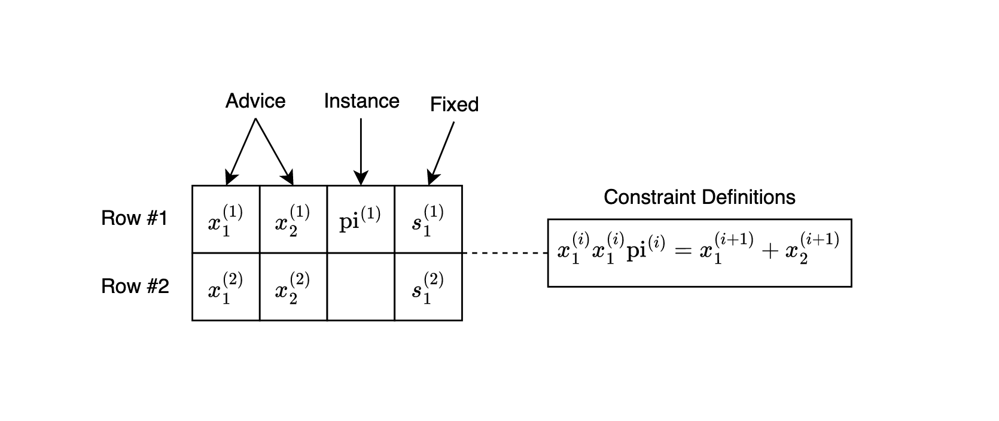

# ZK Input Verification with PLONK/KZG

## Background

### Zero-Knowledge Proofs (ZKPs)

ZKPs allow a prover to convince a verifier that they know a value satisfying some condition, **without revealing the value itself**.

### PLONK and KZG Commitments

- **PLONK** is a universal and updatable SNARK that supports efficient proofs over arbitrary circuits. It allows inputs to be committed using polynomial commitment schemes.
- **KZG Commitments** are polynomial commitments with succinct size and verification. They allow the prover to commit to a polynomial and later prove evaluations at specific points.

## Usage in Trinity

### Verifiable Inputs

In Trinity, input bits committed by the evaluator need to be **verifiable**—they must be provably constrained to binary values and committed in a zero-knowledge way.

Rather than computing a KZG commitment inside a circuit (which would be expensive due to multi-scalar multiplications), we leverage **PLONK’s native use of KZG commitments** for advice columns.

### How It Works

1. **Setup**: A Halo2 circuit is built where the evaluator’s input bit vector is placed in an **advice column**.
2. **Constraint**: Each value is constrained to be a bit (0 or 1) using a simple custom gate:
   $$ s \cdot b \cdot (b - 1) = 0 $$
3. **Proof Generation**: The prover runs Halo2’s KZG-based proving system.
4. **Commit Extraction**: The resulting proof includes a commitment to the advice column—this commitment is extracted and reused in Trinity’s Laconic OT as the receiver’s commitment.

### Code Summary

```rust
let circuit = BitvectorCommitmentCircuit { bitvector };
let proof = create_proof(...);
let commitments = extract_commitments(&proof, 1); // Gets KZG commit to advice column
let com = commitments[0];
```

This commitment becomes the receiver’s `Com` in Laconic OT.

### Visual Overview



```
Advice Column:   [ 1, 0, 1, 1, 0, 0 ]
Constraint:      s * b * (b - 1) = 0  for all b
Commitment:      Com(advice_poly)
Output:          KZG Commitment (G1 point)
```

## Benefits and Considerations

### Advantages

- **Verifiability**: Inputs are guaranteed to be well-formed bitstrings, but you can extend checks to verify a signature or any computation over the bitstring data.
- **Trust Shift**: The evaluator’s commitment is now backed by a ZK proof.
- **Reuse**: Proofs are reusable across OT and other verification protocols.

### Trade-offs

- **Proof Overhead**: Circuit setup and proof generation are heavier than Plain OT (raw KZG commitment).
- **Performance**: Halo2’s proving time and constraint system size must be managed.

## Practical Example

1. **Evaluator Generates a Proof**

```rust
let bitvector = vec![Fr::one(), Fr::zero(), Fr::one()];
kzg_commitment_with_halo2_proof(params, bitvector)
```

2. **Extract Commitment**

```rust
let com = circuit_output.commitment; // G1 commitment to advice column
```

3. **Use in OT**

```rust
let receiver = LaconicOTRecv::new(halo2params, &[Choice::One, Choice::Zero, Choice::One]);
let com = receiver.commitment();
```
